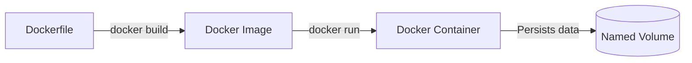

# 05 - Docker i Docker Compose (Prošireno izdanje za Windows 11)

## Cilj lekcije

Cilj ove lekcije je da studenti u potpunosti razumeju teorijske koncepte kontejnerizacije i nauče kako da upakuju i pokrenu čitav multi-service sistem (frontend, backend i PostgreSQL bazu) u sekundi koristeći **Docker** i **Docker Compose**.

Na kraju lekcije student treba da ume da objasni:
- Razliku između **Docker Image-a** (recepta) i **Docker Containera** (aktivnog procesa).
- Prednosti **Multi-Stage Build** pristupa za kreiranje lakih i bezbednih slika.
- Zašto je **Nginx** potreban za serviranje React aplikacija i kako podržava klijentsko rutiranje.
- Kako **Docker Compose** orkestrira servise i upravlja zajedničkom mrežom (**Bridge Network**).
- Zašto se za povezivanje na bazu u Docker mreži koristi ime servisa `postgres` umesto `localhost`.
- Kako da podese i pokrenu Docker Desktop na **Windows 11** operativnom sistemu koristeći **WSL 2**.

---

## 1. Osnovni Docker Koncepti

U modernom softverskom inženjerstvu, rečenica *"kod mene na mašini sve radi"* je neprihvatljiva. Docker rešava ovaj problem tako što izoluje aplikaciju i sve njene zavisnosti u lagan kontejner koji radi identično na svakom računaru (Windows, Mac, Linux) i na produkcionom serveru.



### Ključni pojmovi:
1.  **Docker Image (Slika):** Statički, nepromenljivi paket koji sadrži sve što je potrebno za pokretanje aplikacije (operativni sistem, JRE, biblioteke, naš kompajlirani kod). Slikujemo ga kao "klasu" u objektno-orijentisanom programiranju.
2.  **Docker Container (Kontejner):** Pokrenuta, živa instanca slike. To je izolovan proces na računaru domaćinu. Slikujemo ga kao "objekat" (instancu klase).
3.  **Dockerfile:** Tekstualni fajl koji sadrži sekvencu koraka ("recept") za automatsko građenje slike.
4.  **Docker Volume (Skladište):** Namenski direktorijum van kontejnera u kojem se podaci čuvaju. Kontejneri su privremeni po prirodi (efemerni) — ako se kontejner baze obriše, brišu se i podaci. Volume obezbeđuje da podaci baze prežive gašenje i brisanje kontejnera.
5.  **Docker Network (Mreža):** Virtuelna mreža kroz koju kontejneri komuniciraju. U istoj Compose mreži, kontejneri se međusobno pronalaze na osnovu **imena servisa** kao hostnames.

---

## 2. Dockerizacija Spring Boot Backenda

Za naš backend kreirali smo [Dockerfile](file:///d:/vibe/todo-list/backend/todo-backend/Dockerfile) u folderu `backend/todo-backend/`. Koristimo **multi-stage build** koji nam omogućava da u prvoj fazi kompajliramo kod (za šta nam treba pun JDK i Maven), a u drugoj fazi samo prekopiramo gotov JAR fajl u lagano runtime okruženje (JRE-Alpine) koje zauzima svega ~150MB umesto 600MB+.

### `backend/todo-backend/Dockerfile`
```dockerfile
# Faza 1: Kompajliranje i pakovanje aplikacije
FROM maven:3.9.6-eclipse-temurin-17 AS build
WORKDIR /app

# Kopiranje konfiguracije i izvornog koda
COPY pom.xml .
COPY src ./src

# Kompajliranje koda i pravljenje JAR fajla (preskačemo testove radi brzine)
RUN mvn clean package -DskipTests

# Faza 2: Lagani runtime kontejner
FROM eclipse-temurin:17-jre-alpine
WORKDIR /app

# Kopiramo samo gotov JAR fajl iz prethodne (build) faze
COPY --from=build /app/target/todo-backend-0.0.1-SNAPSHOT.jar app.jar

EXPOSE 8080

# Pokretanje aplikacije
ENTRYPOINT ["java", "-jar", "app.jar"]
```

---

## 3. Dockerizacija React Frontenda

Za naš React frontend (izgrađen na Vite-u) u folderu `frontend/` kreirali smo [Dockerfile](file:///d:/vibe/todo-list/frontend/Dockerfile) i prateći [nginx.conf](file:///d:/vibe/todo-list/frontend/nginx.conf).

Pošto React trči u klijentskom browseru, u produkciji nam ne treba aktivan Node.js server. Zato u prvoj fazi gradimo statičke fajlove (`dist`), a u drugoj fazi ih serviramo preko **Nginx** veb servera na standardnom portu `80`.

### `frontend/nginx.conf`
Ova konfiguracija je ključna. Ona govori Nginx-u da za bilo koju rutu (npr. `/detalji/1`) vrati glavni `index.html` fajl, kako bi React Router na klijentu mogao uspešno da preuzme rutiranje u browseru:
```nginx
server {
    listen 80;
    server_name localhost;

    location / {
        root /usr/share/nginx/html;
        index index.html index.htm;
        try_files $uri $uri/ /index.html;
    }

    error_page 500 502 503 504 /50x.html;
    location = /50x.html {
        root /usr/share/nginx/html;
    }
}
```

### `frontend/Dockerfile`
```dockerfile
# Faza 1: Bildovanje statičkih fajlova
FROM node:20-alpine AS build
WORKDIR /app

COPY package*.json ./
RUN npm ci

COPY . .
RUN npm run build

# Faza 2: Serviranje pomoću ultra-brzog Nginx-a
FROM nginx:1.25-alpine

# Kopiranje naše klijentske ruting konfiguracije
COPY nginx.conf /etc/nginx/conf.d/default.conf

# Kopiranje izgrađenog dist foldera u Nginx direktorijum za statiku
COPY --from=build /app/dist /usr/share/nginx/html

EXPOSE 80

CMD ["nginx", "-g", "daemon off;"]
```

---

## 4. Orkestracija pomoću Docker Compose-a

Uz sve ovo, u korenu projekta kreiran je [docker-compose.yml](file:///d:/vibe/todo-list/docker-compose.yml) koji povezuje bazu, backend i frontend. On opisuje ceo naš stack i sve parametre povezivanja.

### `docker-compose.yml`
```yaml
version: '3.8'

services:
  # 1. Baza podataka
  postgres:
    image: postgres:16-alpine
    container_name: todo-postgres
    environment:
      POSTGRES_DB: todos
      POSTGRES_USER: postgres
      POSTGRES_PASSWORD: postgres
    ports:
      - "5432:5432"
    volumes:
      - pgdata:/var/lib/postgresql/data
    networks:
      - todo-network
    healthcheck:
      test: ["CMD-SHELL", "pg_isready -U postgres"]
      interval: 5s
      timeout: 5s
      retries: 5

  # 2. Spring Boot Backend API
  backend:
    build:
      context: ./backend/todo-backend
      dockerfile: Dockerfile
    container_name: todo-backend
    ports:
      - "8080:8080"
    environment:
      - SPRING_PROFILES_ACTIVE=local-postgres
      - SPRING_DATASOURCE_URL=jdbc:postgresql://postgres:5432/todos
      - SPRING_DATASOURCE_USERNAME=postgres
      - SPRING_DATASOURCE_PASSWORD=postgres
      - SPRING_FLYWAY_ENABLED=true
      - SPRING_JPA_HIBERNATE_DDL_AUTO=validate
    depends_on:
      postgres:
        condition: service_healthy
    networks:
      - todo-network

  # 3. React Frontend
  frontend:
    build:
      context: ./frontend
      dockerfile: Dockerfile
    container_name: todo-frontend
    ports:
      - "80:80"
    depends_on:
      - backend
    networks:
      - todo-network

volumes:
  pgdata:

networks:
  todo-network:
    driver: bridge
```

> [!IMPORTANT]
> **Healthcheck i depends_on zavisnost:** Primetićeš da servis `backend` ima definisano `depends_on` sa uslovom `postgres: condition: service_healthy`. Baze podataka se startuju nekoliko sekundi. Bez ovog uslova, backend bi počeo da se spaja čim se kontejner baze startuje (ali još uvek ne prima konekcije), što bi oborilo backend na samom startu. Ovako, backend čeka da baza prijavi da je u potpunosti zdrava i spremna (`pg_isready`).

---

## 5. Uputstvo za Podešavanje i Rad na Windows 11

Windows 11 koristi izuzetno brz i moderan **WSL 2** (Windows Subsystem for Linux) za pokretanje Docker kontejnera direktno u Linux kernelu bez opterećenja procesora.

### Korak 1: Instalacija i Podešavanje Docker Desktop-a
1.  Preuzeti i instalirati **Docker Desktop for Windows** sa zvaničnog sajta.
2.  Tokom instalacije, obavezno štiklirati opciju **"Use the WSL 2 based engine"** (ovo je preporučeni mod).
3.  Restartovati računar ako instalacija to zatraži.
4.  Nakon startovanja, otvoriti Docker Desktop i ući u Settings (zupčanik gore desno) -> *Resources* -> *WSL Integration* i uveriti se da je integracija aktivna za vašu podrazumevanu Linux distribuciju.

### Korak 2: Komande za Pokretanje Multi-Service Stack-a
Kada je Docker Desktop pokrenut na Windows 11, pozicionirajte se u koren projekta `D:\vibe\todo-list` kroz PowerShell ili CMD i izvršite sledeće komande:

#### 1. Pokretanje cele aplikacije (Build + Start):
Ova komanda će pročitati Compose fajl, kompajlirati backend i frontend unutar kontejnera, skinuti PostgreSQL sliku, povezati mrežu i startovati sve servise u pozadini (`-d` / detached mod):
```powershell
docker compose up --build -d
```

#### 2. Praćenje logova:
Kako biste pratili kako se Flyway migracije pokreću i kako Spring Boot startuje na PostgreSQL-u unutar kontejnera:
```powershell
docker compose logs -f
# Ili samo za backend:
docker compose logs -f backend
```

#### 3. Gašenje stack-a:
Kada završite sa radom, ugasite sve kontejnere i oslobodite resurse na Windows-u:
```powershell
docker compose down
```

#### 4. Brisanje volumena (Reset baze na nulu):
Ukoliko želite da u potpunosti obrišete bazu i pustite Flyway da migracije i seed podatke učita ponovo od nule:
```powershell
docker compose down -v
```

---

## Tipične greške na Windows 11
- **Docker nije pokrenut:** Pokušaj pokretanja `docker compose up` bez otvorenog Docker Desktop-a na Windowsu rezultovaće greškom povezivanja na daemon (`error during connect`). Uvek prvo otvorite Docker Desktop aplikaciju.
- **Port Conflict (Zauzet port):** Ako vam je na Windows-u i dalje pokrenut lokalni PostgreSQL (npr. iz prošle lekcije na portu `5432`), Docker Postgres servis neće moći da se binde na port `5432`. Ugasite lokalnu Windows PostgreSQL uslugu u *Services* pre pokretanja Docker-a.
- **WSL 2 Resource Limit:** Docker Desktop na Windowsu može zauzeti dosta RAM memorije. Preporučuje se kreiranje fajla `%USERPROFILE%\.wslconfig` u kom možete ograničiti resurse (npr. `memory=4GB`) kako bi Windows 11 radio brzo i glatko.

---

## Pitanja za proveru znanja

1.  Objasni razliku između Docker slike i kontejnera kroz analogiju sa klasom i objektom u programiranju.
2.  Zašto je **multi-stage build** odličan za bezbednost i veličinu slika na produkciji?
3.  Čemu služi `nginx.conf` u našem frontend kontejneru i koju grešku rešava kada korisnik ručno osveži neku pod-rutu u browseru?
4.  Zbog čega backend servis u `docker-compose.yml` koristi URL `jdbc:postgresql://postgres:5432/todos` umesto `localhost`?
5.  Objasni ulogu `healthcheck` provere na `postgres` servisu i zašto je `depends_on: condition: service_healthy` bolji od običnog `depends_on`.
6.  Kako WSL 2 arhitektura pomaže bržem radu Docker-a na Windows 11 sistemu?
