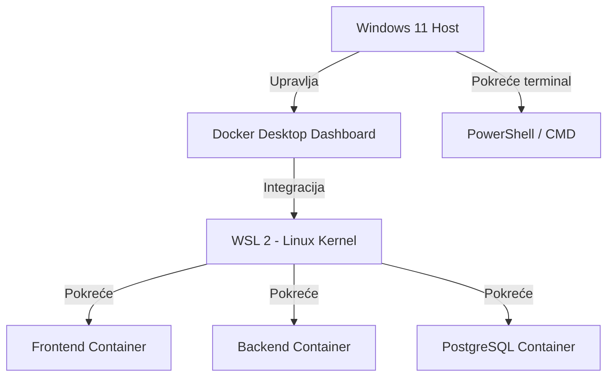
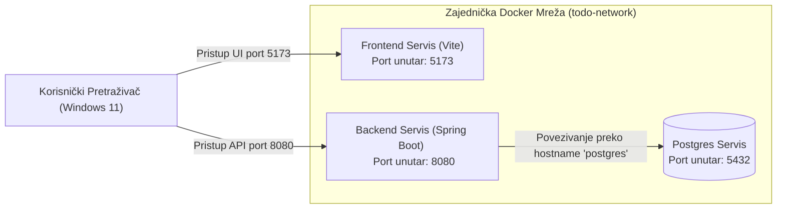

# 05 - Uvod u Docker i Docker Compose (Windows 11 izdanje)

## Cilj lekcije

Cilj ove lekcije je da se studenti upoznaju sa osnovnim konceptima kontejnerizacije i nauče kako **Docker** i **Docker Compose** omogućavaju kreiranje stabilnog, ponovljivog i izolovanog razvojnog okruženja. Poseban fokus je na specifičnostima rada na **Windows 11** platformi, sa akcentom na prevenciju konflikata i razumevanje sistemske arhitekture.

Na kraju lekcije, student treba da ume da definiše i objasni:
- Razliku između Docker slika (**Images**) i kontejnera (**Containers**).
- Ulogu **Dockerfile**-a kao "recepta" za kreiranje okruženja.
- Zašto je bazi podataka neophodan trajni volumen (**Volume**).
- Kako se kontejneri povezuju i komuniciraju unutar virtuelne mreže (**Network**).
- Značaj konfiguracije putem sistemskih promenljivih (**Environment Variables**).
- Kako **Docker Desktop** i **WSL 2** sarađuju na Windows 11 sistemu.

---

## 1. Osnovni Docker Pojmovnik (Docker Dictionary)

Za studente koji se prvi put susreću sa kontejnerima, najlakše je razumeti Docker kroz analogiju sa građevinarstvom ili kulinarstvom:

| Pojam | Opis / Značenje | Analogija |
| :--- | :--- | :--- |
| **Docker Image** | Statički, nepromenljivi fajl koji sadrži sav izvorni kod aplikacije, biblioteke, zavisnosti i operativni sistem neophodan za pokretanje. | Recept za kolač ili građevinski nacrt kuće. |
| **Docker Container** | Živa, pokrenuta i izolovana instanca nekog Image-a. Može se startovati, ugasiti, obrisati i menjati u toku rada. | Pečeni kolač napravljen po receptu ili izgrađena kuća na osnovu nacrta. |
| **Dockerfile** | Tekstualni fajl bez ekstenzije koji sadrži korak-po-korak uputstva (komande) za kreiranje Docker Image-a. | Koraci u kuvaru za pripremu jela. |
| **Docker Volume** | Namenski prostor na disku domaćina (host računara) koji je montiran u kontejner kako bi se podaci čuvali trajno, čak i nakon brisanja kontejnera. | Eksterni hard disk koji čuva vaše podatke bez obzira na to da li je računar upaljen. |
| **Docker Network** | Virtuelni mrežni prostor kreiran od strane Docker-a koji omogućava kontejnerima da bezbedno komuniciraju koristeći svoja imena servisa kao hostnames. | Izolovani ruter unutar vaše kancelarije na koji su povezani samo odabrani računari. |
| **Port Mapping** | Preslikavanje porta sa host računara (npr. Windows 11) na port unutar kontejnera, omogućavajući nam pristup aplikaciji spolja. | Skretničar koji preusmerava posetioce sa ulazne kapije na tačno određena vrata u zgradi. |

---

## 2. Rad na Windows 11: Docker Desktop i WSL 2

Na operativnom sistemu Windows 11, Docker ne može da radi direktno na Windowsovom kernelu jer su Docker kontejneri po prirodi Linux procesi. Zbog toga se koristi **Docker Desktop** koji se oslanja na **WSL 2 (Windows Subsystem for Linux)**.



> [!NOTE]
> **WSL 2** omogućava pokretanje pravog Linux kernela unutar Windows-a sa izuzetno visokim performansama, što čini izvršavanje Docker kontejnera brzim i stabilnim.

---

## 3. Konceptualna Arhitektura Todo Aplikacije u Docker-u

Kada našu Todo aplikaciju prebacimo u Docker Compose okruženje, ona se sastoji od tri izolovana servisa koji komuniciraju unutar iste virtuelne mreže:



### Zašto je važan Hostname?
> [!IMPORTANT]
> Unutar zajedničke mrežne grupe, kontejneri se ne povezuju preko `localhost`-a! 
> Ako bi u backendu stavili da se baza nalazi na `localhost:5432`, backend kontejner bi tražio bazu **unutar samog sebe** i javio bi grešku. Umesto toga, koristi se ime servisa kao hostname (npr. `jdbc:postgresql://postgres:5432/todos`). Docker mrežni DNS će ime `postgres` automatski prevesti u IP adresu baze.

---

## 4. Kritična Upozorenja i Konflikti na Windows 11

Tokom rada sa Docker-om na Windows 11, studenti najčešće nailaze na sledeća dva problema:

### A. Konflikt Portova (Port Binding Error)
Pošto ste u prethodnom koraku instalirali **PostgreSQL direktno na Windows 11**, vaš lokalni Windows servis je zauzeo port **5432**. Ako pokušate da pokrenete Docker kontejner za PostgreSQL koji takođe želi da preslika port na `5432:5432` na vašem računaru, dobićete grešku:
`Bind for 0.0.0.0:5432 failed: port is already allocated` ili `address already in use`.

**Rešenja:**
1.  **Privremeno stopirajte Windows PostgreSQL servis** pre pokretanja Docker-a. U PowerShell-u (kao Administrator) pokrenite:
    ```powershell
    net stop postgresql-x64-16
    ```
    *(Zamenite `16` sa verzijom koju ste instalirali).*
2.  **Promenite mmapiranje portova** u Docker Compose konfiguraciji da koristi slobodan spoljni port (npr. `5433:5432`). Na taj način kontejner radi na portu `5432` interno, ali mu Windows pristupa preko porta `5433`.

### B. Razlika u Putanjama (Slashes)
Windows koristi obrnute kose crte (`\`) za putanje fajlova (npr. `D:\PostgreSQL\data`), dok Linux i Docker unutar kontejnera koriste isključivo obične kose crte (`/`). Prilikom konfigurisanja volumena u Docker-u, uvek koristite obične kose crte!

---

## 5. Značaj Environment Varijabli

Jedan od najvažnijih koncepata 12-Factor aplikacija jeste **odvajanje konfiguracije od koda**.
Aplikacija ne sme da ima "zakucane" (hardcoded) adrese baze, lozinke i ključeve u kodu. Umesto toga, sve ove vrednosti se čitaju iz okruženja (Environment Variables):

- `SPRING_DATASOURCE_URL` (npr. `jdbc:postgresql://postgres:5432/todos`)
- `SPRING_DATASOURCE_USERNAME` (npr. `postgres`)
- `SPRING_DATASOURCE_PASSWORD` (npr. `postgres`)
- `SPRING_PROFILES_ACTIVE` (npr. `local-postgres`)

> [!TIP]
> Korišćenjem promenljivih, isti izgrađeni Docker Image možemo bez ikakve izmene koda pokrenuti lokalno na računaru programera, na test serveru ili na produkcionom klaudu. Menjaju se samo vrednosti promenljivih u okruženju!

---

## Pitanja za Proveru Znanja

1.  Objasnite razliku između Docker Image-a i Docker Kontejnera kroz analogiju.
2.  Šta je to Docker Volume i zašto je neophodan za baze podataka poput PostgreSQL-a?
3.  Zašto u Docker Compose okruženju backend aplikacija ne može da koristi `localhost` u JDBC konekcionom stringu za povezivanje sa bazom?
4.  Koji problem na Windows 11 operativnom sistemu izaziva grešku `port is already allocated` pri podizanju Postgres kontejnera i kako se to rešava?
5.  Kako se zove podsistem u Windows 11 koji omogućava visoke performanse i izvršavanje Linux kontejnera pod Docker Desktopom?
6.  Objasnite prednost konfigurisanja baze podataka putem Environment varijabli u odnosu na upisivanje vrednosti direktno u `application.properties`.
